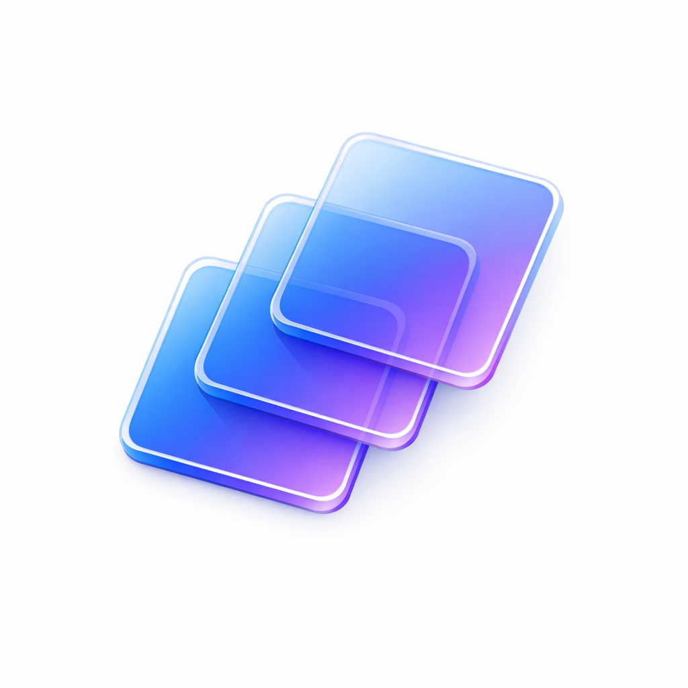

# PluralMac

<p align="center">
  
</p>

<p align="center">
  <strong>Run multiple instances of the same macOS app with isolated data</strong>
</p>

<p align="center">
  <a href="#features">Features</a> •
  <a href="#supported-apps">Supported Apps</a> •
  <a href="#installation">Installation</a> •
  <a href="#usage">Usage</a> •
  <a href="#how-it-works">How It Works</a>
</p>

---

## Overview

PluralMac allows you to run multiple independent instances of the same macOS application, each with its own isolated data storage. Perfect for:

- 🎵 **Multiple Spotify accounts** - Personal and work playlists on separate instances
- 💬 **Multiple Slack workspaces** - Different accounts running simultaneously  
- 🎮 **Multiple Discord accounts** - Gaming and community servers separate
- 💻 **Multiple VS Code/Cursor instances** - Per-project isolated environments
- 🌐 **Multiple browser profiles** - Work/personal separation

## Features

- ✅ **No app modification** - Original apps remain untouched
- ✅ **Complete data isolation** - Each instance has its own cache, settings, and login
- ✅ **Run simultaneously** - Multiple instances can run at the same time
- ✅ **Simple UI** - Create and manage instances with a few clicks
- ✅ **App-specific optimizations** - Uses the best isolation method for each app

## Supported Apps

### ✅ Fully Supported (Tested)

| App | Isolation Method | Notes |
|-----|------------------|-------|
| **Spotify** | `--mu` flag | Official multi-instance support |
| **Google Chrome** | `--user-data-dir` | Full profile isolation |
| **Microsoft Edge** | `--user-data-dir` | Full profile isolation |
| **Brave Browser** | `--user-data-dir` | Full profile isolation |
| **Arc Browser** | `--user-data-dir` | Full profile isolation |
| **Vivaldi** | `--user-data-dir` | Full profile isolation |
| **Discord** | `--multi-instance` | ⚠️ Multiple windows only, same account |
| **Slack** | `--user-data-dir` | Multiple workspaces |
| **VS Code** | `--user-data-dir` | Per-project environments |
| **Cursor** | `--user-data-dir` | Per-project environments |
| **Firefox** | `-profile` | Profile directory isolation |
| **Waterfox** | `-profile` | Profile directory isolation |

### ⚠️ Partially Supported

| App | Status | Notes |
|-----|--------|-------|
| **Electron apps (generic)** | May work | Try `--user-data-dir` |
| **ToDesktop apps** | May work | Similar to Electron |
| **Generic apps** | Varies | HOME redirection attempted |

### ❌ Not Supported

| App | Reason |
|-----|--------|
| **Mac App Store apps** | Sandboxed - cannot modify data location |
| **Apple system apps** | Protected by SIP |
| **Apps with license verification** | May detect multiple instances |

### ⚠️ Limited Support (Multiple Windows Only)

| App | Notes |
|-----|-------|
| **Discord** | Can run multiple windows with `--multi-instance`, but ALL share the same account/data. Discord ignores `--user-data-dir` and `HOME` redirection. |

## Installation

### Requirements

- macOS 14.0 (Sonoma) or later
- Target apps must be non-sandboxed

### Build from Source

```bash
# Clone the repository
git clone https://github.com/yourusername/PluralMac.git
cd PluralMac

# Open in Xcode
open PluralMac.xcodeproj

# Build and Run (⌘R)
```

### Download Release

> Coming soon - check the Releases page for pre-built binaries.

## Usage

### Creating an Instance

1. **Launch PluralMac**
2. Click the **"+"** button or **"New Instance"**
3. **Select an application** from your `/Applications` folder
4. **Name your instance** (e.g., "Spotify Work", "Chrome Personal")
5. Click **"Create"**

### Launching an Instance

1. Select an instance from the list
2. Click **"Launch"** or double-click

The app will open with isolated data - you'll need to log in fresh on first launch.

### Managing Instances

- **Rename**: Right-click → Rename
- **Delete**: Right-click → Delete (optionally delete data too)
- **Reveal Data**: Right-click → Show Data in Finder
- **Duplicate**: Right-click → Duplicate

## How It Works

PluralMac uses different isolation strategies depending on the application:

### 1. App-Specific Arguments

Many apps support command-line arguments for data isolation:

```bash
# Spotify
Spotify --mu=instance-uuid

# Chromium-based browsers
Chrome --user-data-dir=/path/to/data

# Firefox-based browsers
Firefox -profile /path/to/profile

# Discord
Discord --multi-instance --user-data-dir=/path/to/data
```

### 2. NSWorkspace Launch

PluralMac uses `NSWorkspace.openApplication()` with:
- Custom environment variables
- Command-line arguments
- `createsNewApplicationInstance = true`

This launches apps properly through macOS while passing isolation parameters.

### Data Storage

Instance data is stored in:
```
~/Library/PluralMac/
├── Data/
│   ├── <instance-uuid-1>/    # Isolated data for instance 1
│   ├── <instance-uuid-2>/    # Isolated data for instance 2
│   └── ...
└── instances.json            # Instance configurations
```

## Architecture

```
PluralMac/
├── App/                    # App entry point
├── Models/
│   ├── AppInstance.swift   # Instance configuration model
│   ├── Application.swift   # Detected application model
│   └── AppType.swift       # App type detection & isolation methods
├── ViewModels/
│   └── InstanceViewModel.swift  # Main view model
├── Views/
│   ├── Main/               # Main window views
│   ├── Creation/           # Instance creation wizard
│   └── Settings/           # Settings views
├── Services/
│   ├── DirectLauncher.swift     # NSWorkspace-based launcher
│   ├── AppDetector.swift        # App type detection
│   └── InstanceStore.swift      # Persistence
└── Utilities/
```

## Troubleshooting

### App opens with original data

**Cause**: The app doesn't support the isolation method being used.

**Solution**: 
1. Check if the app is in the "Supported Apps" list
2. Try adding custom command-line arguments in instance settings
3. Some apps may require different flags

### App won't launch

**Cause**: Missing permissions or invalid app path.

**Solution**:
1. Ensure PluralMac has Full Disk Access (System Settings → Privacy & Security)
2. Verify the original app still exists at the expected path
3. Check Console.app for error messages

### Multiple instances show same data

**Cause**: App uses system keychain or shared preferences.

**Solution**: Some data (like login tokens in Keychain) may be shared. You may need to:
1. Log out of the original app first
2. Use the isolated instance to log in with a different account

### "App is damaged" error

**Cause**: macOS Gatekeeper blocking unsigned apps.

**Solution**:
```bash
xattr -cr /path/to/app.app
```

## Contributing

Contributions are welcome! Please:

1. Fork the repository
2. Create a feature branch
3. Submit a pull request

### Adding Support for New Apps

To add support for a new application:

1. **Detect the app type** in `AppDetector.swift`
2. **Add isolation arguments** in `AppInstance.effectiveCommandLineArguments`
3. **Test thoroughly** with multiple instances
4. **Update this README** with the new app

## License

MIT License - see [LICENSE](LICENSE) for details.

## Acknowledgments

- Built with SwiftUI and modern macOS APIs

---

<p align="center">
  Made with ❤️ for macOS power users
</p>
